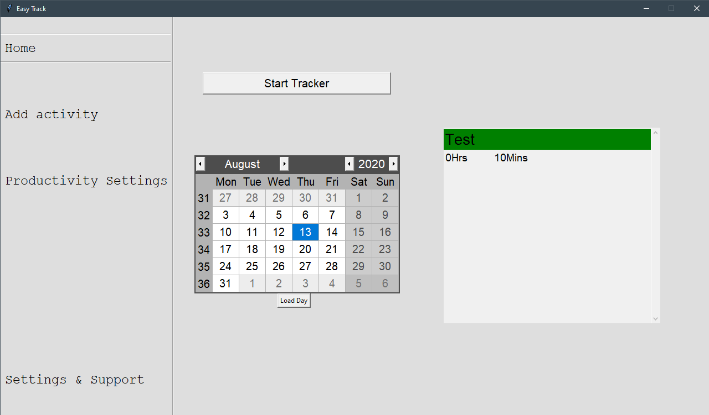

# Easy Track
Easy Track is a productivity tracker that gives users the ability to track their application use on their computer, web browsing use (Tested and works on Firefox and Edge), and manually add in activities that they had during the day such as going to a meeting.

This application only currently works on Windows computers.

## Getting Started
- Download or clone this repository
- Run the gui.py file
